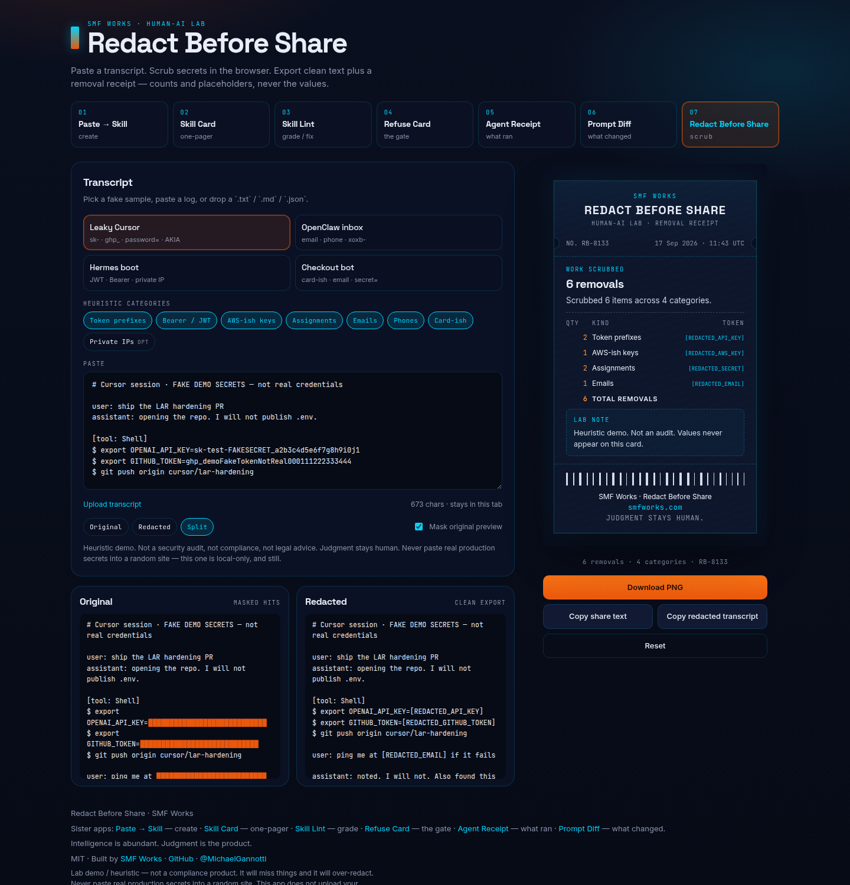
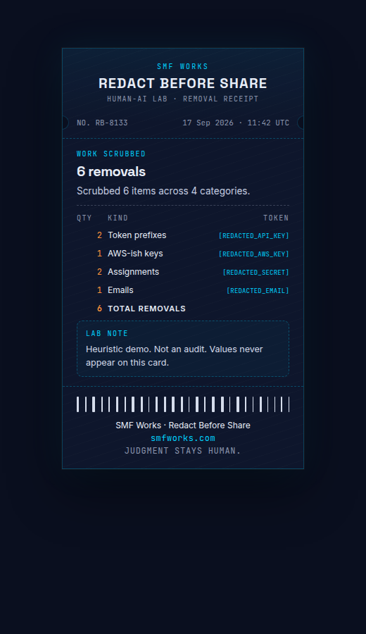
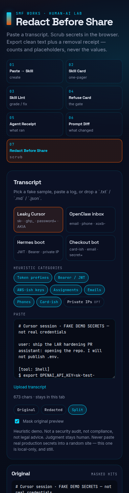

# Redact Before Share

Paste an agent transcript. Scrub secrets and PII **in the browser**. Walk out with clean text plus a shareable **removal receipt** — counts by category and placeholders like `[REDACTED_API_KEY]`, never the values.

Pairs with [Agent Receipt](https://github.com/smfworks/agent-receipt): print what ran, then scrub the log before you post it.

**Paste a session. Strip the secrets. Share the receipt — not the keys.**

[](LICENSE)

SMF Works viral kit:

1. **[Paste → Skill](https://github.com/smfworks/paste-to-skill)** — create
2. **[Skill Card](https://github.com/smfworks/skill-card)** — one-pager
3. **[Skill Lint](https://github.com/smfworks/skill-lint)** — grade / fix
4. **[Refuse Card](https://github.com/smfworks/refuse-card)** — the gate
5. **[Agent Receipt](https://github.com/smfworks/agent-receipt)** — what ran
6. **[Prompt Diff](https://github.com/smfworks/prompt-diff)** — what changed
7. **Redact Before Share (this)** — scrub before you share

## Screenshots

Desktop split (paste + original/redacted left, removal receipt right). Mobile stacks the compositor above the card.







## Why a removal receipt?

Agent logs are how work gets reviewed — and how keys leak into Slack, X, and GitHub issues. A receipt is small enough to screenshot and specific enough to argue with: how many API-key-shaped strings, emails, card-ish digit runs. The values stay off the card.

It is a lab artifact, not a compliance product. **Heuristic demo. Not a security audit. Not legal advice. Judgment stays human.**

Never paste real production secrets into a random site. This app is local-only (no backend, no auth, no API keys) and still: a screenshot of the unmasked original, or a compromised machine, can leak. Read the redacted text before you share it.

## Quickstart

```bash
npm install
npm run dev
```

Open [http://localhost:5173](http://localhost:5173).

```bash
npm run build
npm run preview
npm test
```

Node 20+ (22 recommended). Client-side only — no auth, no backend, no API keys, no secrets leave the browser.

## Use it

1. Pick **Leaky Cursor**, **OpenClaw inbox**, **Hermes boot**, or **Checkout bot**, or paste / drop a `.txt` / `.md` / `.json` / `.log`.
2. Toggle category chips (token prefixes, Bearer/JWT, AWS-ish, assignments, emails, phones, card-ish, private IPs). Private IPs start **off**.
3. Preview **Original** (hits masked by default), **Redacted**, or **Split**.
4. **Download PNG** of the receipt, **Copy share text**, or **Copy redacted transcript**. **Reset** clears the compositor.

Useful query params: `?sample=leaky-cursor`, `?sample=openclaw-inbox`, `?sample=hermes-boot`, `?sample=checkout-bot`, `?view=split`, `?mask=0`, `?shot=card`, `?shot=og`.

## Heuristic (not a scanner)

The rule table lives in [`src/lib/redact.ts`](src/lib/redact.ts). Edit patterns. Reload. Overlaps prefer the more specific category (token prefix beats `api_key=`).

| Chip | On by default | What it matches | Placeholder |
| --- | --- | --- | --- |
| Token prefixes | yes | `sk-` / `ghp_` / `github_pat_` / `xoxb-` / `npm_` / `AIza` | `[REDACTED_API_KEY]` · `[REDACTED_GITHUB_TOKEN]` · `[REDACTED_SLACK_TOKEN]` |
| Bearer / JWT | yes | `Bearer …` and `eyJ….….…` JWTs | `[REDACTED_BEARER]` · `[REDACTED_JWT]` |
| AWS-ish | yes | `AKIA` / `ASIA` + 16 | `[REDACTED_AWS_KEY]` |
| Assignments | yes | `password=` / `secret=` / `api_key=` values | `[REDACTED_SECRET]` |
| Emails | yes | address-shaped strings (`git@` skipped) | `[REDACTED_EMAIL]` |
| Phones | yes | `+1 555…` / `(555)` / `555-010-2211` | `[REDACTED_PHONE]` |
| Card-ish | yes | grouped 13–19 digit runs, or ungrouped Luhn-ish | `[REDACTED_CARD]` |
| Private IPs | **no** | RFC1918 + loopback | `[REDACTED_PRIVATE_IP]` |

This is pattern matching on text. It will miss real secrets and it will flag things that are not. That is the point of a human gate.

Samples that ship in [`public/samples/`](public/samples/) (all clearly fake):

| File | What it shows |
| --- | --- |
| `leaky-cursor.txt` | `sk-test-` · `ghp_` · `password=` · `AKIA…EXAMPLE` · email |
| `openclaw-inbox.txt` | Slack `xoxb-` · emails · phones |
| `hermes-boot.txt` | Bearer JWT · optional private IPs |
| `checkout-bot.txt` | Visa/MC test PANs · email · `secret=` |

## Host a demo

Static files from `npm run build` (output: `dist/`).

Or Docker:

```bash
docker build -t redact-before-share .
docker run --rm -p 8080:80 redact-before-share
```

Then open [http://localhost:8080](http://localhost:8080).

## Stack

Vite + React + TypeScript. Redaction is client-side heuristics (no model, no keys). PNG export via `html-to-image`. Fonts: Inter, Space Grotesk, JetBrains Mono. Palette: navy `#0A0F1F`, ember `#ea580c`, cyan `#00D4FF`.

## Built by SMF Works

[SMF Works](https://smfworks.com) is a human-AI research lab. We publish what we learn, ship open agent tools, and install stacks on hardware you own.

Intelligence is abundant. Judgment is the product.

- Lab: [smfworks.com](https://smfworks.com)
- GitHub: [github.com/smfworks](https://github.com/smfworks)
- X: [@MichaelGannotti](https://x.com/MichaelGannotti)
- Sister apps: [Paste → Skill](https://github.com/smfworks/paste-to-skill) · [Skill Card](https://github.com/smfworks/skill-card) · [Skill Lint](https://github.com/smfworks/skill-lint) · [Refuse Card](https://github.com/smfworks/refuse-card) · [Agent Receipt](https://github.com/smfworks/agent-receipt) · [Prompt Diff](https://github.com/smfworks/prompt-diff)

MIT licensed. No medical or legal claims. This is a shareable receipt, not an audit, not advice, and not a hosted DLP product.

## License

[MIT](LICENSE) © 2026 SMF Works
